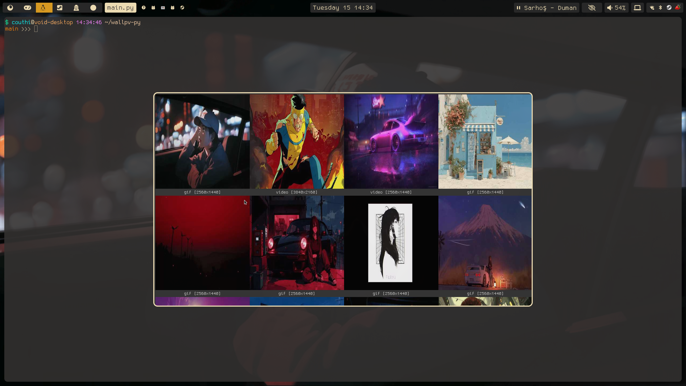

# A GUI FOR MPVPAPER WRITTEN IN GTK


## Usage
To get started with wallpv, you'll need a config file, which should be in:
```
/home/youruser/.config/wallpv/wallpv.conf
```
The config should contain a **single** line that points to your wallpaper folder, eg:
```
/home/Pictures/mygifs
```

## How Do I Make My Wallpaper Apply On Start Up?
Wallpv writes the path to your chosen folder into 
```
/home/youruser/.config/wallpv/wallpaper.txt
```
You can use your window manager/desktop environment's startup features, with which you can start mpvpaper by feeding it this file.

An example for Niri:
```
spawn-at-startup "sh" "-c" "mpvpaper ALL -p -o \"loop no-audio\" $(cat ~/.config/wallpv/wallpaper.txt)"
```

With this method, the first time I log in, I will be starting mpvpaper by using the file wallpv creates, once you set this up, your wallpapers will always be persistent.

## How To Build Wallpv
first, clone this repo and enter it:
```
git clone https://github.com/CoutHi/wallpv.git
cd wallpv
```

Once inside, run the commands:
```
cmake .
make
```

And you're done. You can now use wallpv by calling
```
./wallpv
```
from the directory or adding it as a keybind to your window manager/desktop environment.

Example for Niri:
```
Mod+Shift+V hotkey-overlay-title="Open Wallpv" { spawn "/home/couthi/wallpv-c/wallpv" ;}
```

## Known Limitations
There are currently some limitations with the program since it's still very early in development. These include but aren't limited to:  

	+ MAX 1024 Files  
	+ Slow Start (only the first time a folder is scanned)
	+ Slow Python Dependency
	+ No Multi Folder (untested)
	+ Most Formats That Aren't Gifs Aren't Yet Tested
	+ Static Images (PNG,JPG) Are Still Cached, Which Takes Time And Space

