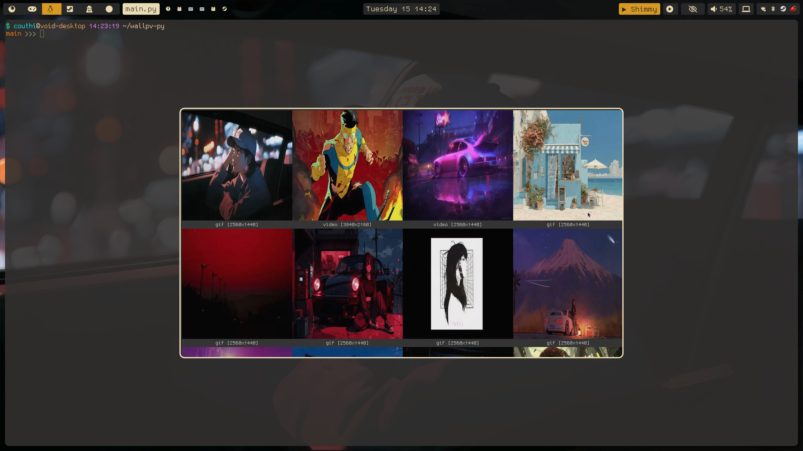

# Wallpv Is A GUI For Mpvpaper

## About the project

I was annoyed by having to change my wallpaper, for which I use mpvpaper, manually through the terminal all the time, so I wrote a GTK-4 GUI for it in Python.

I am very new to Python programming (basically learned everything while coding this), so I'd appreciate any tips and tricks on how to best distribute this program to users.

#### You Will need ffmpegthumbnailer, python-opencv and mpvpaper installed!

## Changelog
[CHANGELOG.md](/CHANGELOG.md)

## How it works:

You can edit the ~/.config/wallpv/wallpv.ini file to point to the folder where you store your gifs/mp4s (these currently the only accepted file types).

After editing the config for your needs, simply run the program, first startup might take while since it'll generate thumbnails for all the gifs and mp4s it finds and put them in ~/.cache/wallpv, afterwards all you need to do is selecting the wallpaper you want!

The GUI will create a file called wallpaper.txt in ~/.config/wallpv which will contain the path to your chosen wallpaper, you can use this file to modify however you launch mpvpaper in your desktop for the first time to point to the wallpaper you have chosen.

## The Config Should Look Like This:

```
[Path]
folder = /home/couthi/Pictures/gif-wall/
```

## inside ~/.config/wallpv/wallpv.ini

## TODO
* Roadmap
	+ Static Images With Swww or similar for memory efficiency
	+ A More Efficient Way Of Caching/Displaying
	+ Multiple Source Folder Support
	+ Some Optimization Is Needed 
	+ Dependency reduction
	+ File deletion 
	+ Gif conversion

### Screenshot(s)


